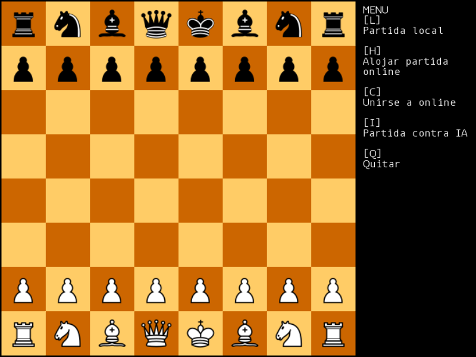

# Chess

#### Dependecies
SFML 2.5

#### Compilation
The script compile should do it, if you have the SFML libraries in your link path.

#### To Do
- Currently the AI is not implemented. Its behaviour is playing random (but valid) moves.

## Game Modes

### Local
Human vs Human in the same machine.
### Online
Human vs Human in different machines (or instances of the process).
1. One of them must [Host] the game. When the option is selected, your local IP address will be shown in the window.
2. Then, the other player must select the [Connect] option and introduce the IP address of the host.
3. The host will be the White Team.
4. When one of the players disconnects or when the game ends, conexion will be closed.

### IA
Human vs Computer in the same machine.
